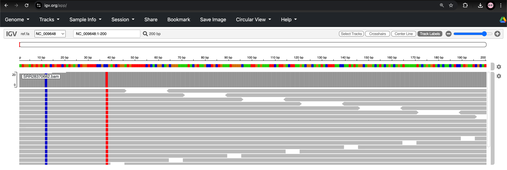

# Bioinformatics Analysis for Antimicrobial Resistance Genomic Surveillance: Long Reads; _Klebsiella pneumoniae_  

---  

###### **_Trainers_**: [John Juma](https://github.com/ajodeh-juma), [Kennedy Mwangi](https://github.com/wanjauk), [Gilbert Kibet](https://github.com/kibet-gilbert) & [Ouso Daniel](www.linkedin.com/in/ousodaniel)

---

## Table of Contents
  - [Overview](#overview)
  - [Learning Objectives](#learning-objectives)
  - [Prerequisites](#background)
  - [prerequisites](#prerequisites)
  - [Scope of the Tutorial](#scope-of-the-tutorial)
  - [Set-up](#set-up)
      - [Workshop Environment](#workshop-environment)
      - [Logging into the HPC](#logging-into-the-hpc)
      - [Compute Node](compute-node)
      - [Project organisation](#project-organisation)
  - [Bioinformatics Analysis](#bioinformatics-analysis)
      - [About the Sample](#about-the-sample)
      - [Step 1: Data Quality Assessment](#step-1-data-quality-assessment)
      - [Step 2: Genome Assembly](#step-2-genome-assembly)
      - [Step 3: Genome Annotation](#step-3-genome-annotation)
      - [Step 4: Pathogen Relatedness](#step-5-pathogen-relatedness)
          - [MLST](#mlst)
              - [MLST Output Format](#mlst-output-format)
              - [MLST Results Interpretation](#mlst-results-interpretation)
              - [Visualising MLST Results](#visualising-mlst-results)
              - [MLST Interpretation
                Limitations](#mslt-interpretation-limitations)
      - [Step 5: Genome Annotation](#step-4-amr-detection)
      - [Step 6: AMR Detection](#step-4-amr-detection)
          - [Output Formart](#output-format)
          - [AMR Dectection with ResFinder](#amr-detection-with-resfinder)
          - [AMR Dectection with CARD/RGI](#amr-detection-with-card/rgi)
      - [Step 7: Variant Calling and Consensus Assemblies](#step-6-variant-calling-and-consensus-assemblies)
       - [Fast Bacterial Variant Calling with Contigs](#fast-bacterial-variant-calling-with-contigs)
          - [Snippy Outputs](#snippy-outputs)
          - [Visualising Snippy Variants](#visualising-snippy-variants)
          - [Build Core and Whole Genome Alignments from Snippy Output](#build-core-and-whole-genome-alignments-from-snippy-output)
          - [Run Snippy-core](#run-snippy-core)
          - [Snippy Core Outputs](#snippy-core-outputs)
          - [Cleanup the Snippy SNP Alignment Intermediates](#cleanup-the-snippy-snp-alignment-intermediates)
          - [Compute Pairwise SNP Distances](#compute-pairwise-snp-distances)
- [Step 8: Dealing with Recombination](#step-7-dealing-with-recombination)
    - [Phylogenetic Analysis of Gubbins Output](#phylogenetic-analysis-of-gubbins-output)
    


## Overview
Welcome to this workshop on antimicrobial resistance (AMR) genomics analysis!

This workshop is designed for professionals who are already familiar with AMR and genomics concepts but are looking to develop practical bioinformatics skills for analysing genomic data related to AMR.
We'll explore the fundamental concepts, tools, and workflows used in AMR
genomics analysis, with a focus on practical applications using _Escherichia
coli_ and _Klebsiella pneumoniae_ sequencing data.

## Learning Objectives
By the end of this workshop, you will be able to:

- Understand the role of genomics in AMR surveillance and research
- Process and analyze logn-read sequencing data to identify AMR genes and mutations
- Use common bioinformatics tools to interpret AMR-related genomic data
- Implement basic genomic analysis workflows for AMR detection

## Prerequisites
This workshop assumes:

- Familiarity with basic microbiology and antimicrobial resistance mechanisms
- Understanding of fundamental genomics concepts
- Basic command-line skills

## Introduction  
<!-- *Escherichia coli* are ubiquitous bacteria found in the environment including the gut of humans and other animals and consists of numerous types and strains. Most types of *E. coli* are normal inhabitants of the gut of animals and do not cause diseases. However, some of the strains of *E. coli* have acquired genes or gen mutations that enable them to cause disease. These strains are commonly associated with food poisoning leading to diarrhoea and are referred to as diarrheagenic *E. coli* (DEC). Transmission occurs primarily through contaminated food but can also occur via person-to-person transmission, animal contact and water. For example, Shiga toxin-producing *E. coli* (STEC) serotype O157:H7 causes bloody diarrhoea and has previosuly been responsible for outbreaks worldwide.    -->

_Klebsiella pneumoniae_ is a Gram-negative, opportunistic pathogen notorious for causing hospital-acquired infections, including pneumonia, bloodstream infections, and urinary tract infections. A major concern is its propensity for antimicrobial resistance (AMR), particularly through extended-spectrum β-lactamases (ESBLs) and carbapenemases (e.g., KPC, NDM), which render last-resort antibiotics like carbapenems ineffective. Multidrug-resistant (MDR) and extensively drug-resistant (XDR) strains are increasingly reported worldwide, fueled by plasmid-mediated resistance genes and clonal spread in healthcare settings.

The rise of AMR in _K. pneumoniae_ underscores the urgent need for enhanced surveillance, infection control, and novel therapeutics. 

## Scope of the Tutorial  
In this workshop we will tackle, hands-on, the basic principles employed to generate consensus genome sequences of *E. coli* and *K. pneumoniae* and identify the serotypes involved in outbreaks, anti-microbial resistance genes (AMRs) and possible virulence factors they may have. 

## Set-up  
### Workshop Environmnet
The workshop is mainly based on working in a HPC envirnment. However, local set-ups will be provisioned, although some steps of the workflows may be impossible to execute on laptops. For access to the HPC, you will use your personal computers to log into the ILRI HPC cluster, which operates on a Linux operating system. If using a non-Unix operating system you will require a program that enables interfacing with the Linux HPC environment.

<!-- ## Analysis preprations -->

### Logging into the HPC  
To log in to the HPC, you use the provided details (username and password) with the below command. The username follows the parttern `Bio4InfoXX`, where `XX` is a number.
```
ssh <user_name>@hpc.ilri.cgiar.org
```
- Replace `<user_name>` in the command with the provided username and execute (press enter). 
- Next, you will be prompted for the password.  
 >***Note:*** The password will not be visible to you as you type--just a little faith.

### Compute Node
There are two nodes to choose from: `compute05`  and `compute06`. If your username (`Bio4InfoXX`) ends with an ***Odd Number*** (1,3,5,7,9...) use `compute05` and if it ends with an ***even number*** (2,4,6,8...) use `compute06`. For the purposes of this workshop we will each avail four vCPUs (two CPU cores).  
>Compute05
```
interactive -w compute05 -c 2 -J amr-surveillance -p batch
```
>Compute06
```
interactive -w compute06 -c 2 -J amr-surveillance -p batch
```
- `-w compute05`: specifically request to run the session on `compute05`.
- `-c 2`: allocate 2 CPU cores.
- `-J amr-surveillance`: names the job _amr-surveillance_.
- `-p batch`: specifies the `SLURM` partition (queue) to use, here `batch`.

<details>
    <summary>
        Click to toggle <b style='color:blue'>Modules to load</b>
    </summary>
</details>

### Project Organisation  
For any Bioinformatics project, it's good practice to have a structured file system to ensure proper logical separation of components. By so doing, we enhance clarity, collaboration and reproducibility. Before commencing our analysis, we will start by setting up the project directory structure. Widely adopted project structure include the following directories:
- `data`: stores copy of the original raw data
- `scripts`: stores utility scrippts and code
- `results`/`outputs`: stores analysis results/output
- `logs`: stores reference logs
- `tmp`/`scratch`: stores tempoary/intermediate process outputs

1. *Create a course directory called `ACDC_AMR2025`:*

```
mkdir -p /var/scratch/$USER/ACDC_AMR2025
```

# Change directory into the created directory

```
cd /var/scratch/$USER/ACDC_AMR2025
```

>**Note** Once inside the `hpc`, all instances of ```$USER``` will be equivalent to the `hpc` username that you were assigned. Your username, by default, is stored in a variable called `USER`. By using it, you will not have to type your username, rather, your shell will automatically retrieve your username which is the value stored in the `USER` variable. The `$` (dollar) prefix is used to retrieve the value of that variable.

2. *Create project sub-directories:*

```
mkdir -p \
results/ont/klebsiella/{porechop,nanoq,fastq-scan,nanoplot,dragonflye,prokka,amrfinder,mlst,resfinder,iqtree,tmp/{dragonflye,prokka,amrfinder,snippy},snippy,snippy-core,gubbins}
```

3. *Create symblic links to the required resources

```
ln -sf /var/scratch/global/jjuma/ACDC_AMR2025/[dpsr]* .
```


> **Note:**  We create a project root directory `ACDC_AMR2025` to store all that pertains to this tutorial/project. Within `ACDC_AMR2025` we created sub-directories aligned with the workflow tools.

## Bioinformatics Analysis

### About the Sample
**Project accession:** [PRJNA1087001](https://www.ncbi.nlm.nih.gov/bioproject/PRJNA1087001/)

**Project paper:** [Publication](https://elifesciences.org/reviewed-preprints/98300)

**Project summary:** Benchmark various nanopore-based variant callers on 14
different species. Samples are sequenced on the latest (September 2023) R10.4.1
Nanopore flowcells and Illumina. Ground truth assemblies are generated for each
sample.

**Methods**
Bacterial isolates were streaked onto agar plates and grown overnight at 37°C.

ONT library preparation was performed using either Rapid Barcoding Kit V14
(SQK-RBK114.96) or Native Barcoding Kit V14 (SQK-NBD114.96). Long-read
whole-genome sequencing was performed on a MinION Mk1b or GridION using R10.4.1
MinION flow cells (FLO-MIN114). 

### Step 1: Load required modules

```
module load nanoplot/1.42.0
module load dragonflye/1.2.1
module load porechop/0.3.2pre
module load bbmap/38.95
module load prokka/1.14.6
module load resfinder/4.6.0
module load amrfinder/4.0.22
module load mlst/2.23.0
module load seqkit/0.11.0
```


### Step 2: Retrieve reference genome in GenBank and FASTA format

```
mkdir -p ./genomes/klebs
```

```
wget -c https://ftp.ncbi.nlm.nih.gov/genomes/all/GCF/000/016/305/GCF_000016305.1_ASM1630v1/GCF_000016305.1_ASM1630v1_genomic.gbff.gz -P ./genomes/klebs
```

```
gzip -c -d ./genomes/klebs/GCF_000016305.1_ASM1630v1_genomic.gbff.gz > ./genomes/klebs/GCF_000016305.1_ASM1630v1_genomic.gbff
```

```
wget -c https://ftp.ncbi.nlm.nih.gov/genomes/all/GCF/000/016/305/GCF_000016305.1_ASM1630v1/GCF_000016305.1_ASM1630v1_genomic.fna.gz -P ./genomes/klebs
```

```
gzip -c -d ./genomes/klebs/GCF_000016305.1_ASM1630v1_genomic.fna.gz > ./genomes/klebs/GCF_000016305.1_ASM1630v1_genomic.fna
```


### Step 3: Data Quality Assessment
We start by exploring the quality of the raw sequence reads. We need to know
whether the data is worth commencing analysis on, or otherwise.

**Initial quality assessment**

`NanoPlot` is a python package for plotting various aspects of Nanopore sequencing data (fastq) and alignments (bam).

```
NanoPlot \
    --threads 2 \
    --fastq ./data/klebs/subsampled/SRR28370682.fastq.gz \
    --outdir ./results/ont/klebsiella/nanoplot/ \
    --prefix SRR28370682-original_
```


The HPC does not provide a graphical interface, therefore, we must transfer the
quality assessment results to our local computer to view the outputs. The
`rsync` or `scp` commands can help us with the transfer. 

**Copy the NanoPlot report to your `home` directory on `hpc`**

```
rsync -avP \
    --partial \
    ./results/ont/klebsiella/nanoplot/SRR28370682-original_NanoPlot-report.html \
    ~/
```

On the terminal of your local machine transfer the QC report file as below.

**Copy the NanoPlot report to your `home` directory on `local pc`**

```
rsync -avP --partial <user_name>@hpc.ilri.cgiar.org:~/SRR28370682-original_NanoPlot-report.html ~/
```

For example:

```
rsync -avP --partial jjuma@hpc.ilri.cgiar.org:~/SRR28370682-original_NanoPlot-report.html ~/
```

**Remove adapters**

Sequencing adapters are short sequences added to genomic fragments during library preparation to enable sequencing, which must be removed before downstream analysis.


```
porechop \
    --input ./data/klebs/subsampled/SRR28370682.fastq.gz \
    --format fastq.gz \
    --threads 4 \
    --no_split \
    --output ./results/ont/klebsiella/porechop/SRR28370682_adapter_ont.fastq.gz
```


**Quality filter**

`Nanoq` implements ultra-fast read filters and summary reports for
high-throughput nanopore reads. We can filter the reads based on the quality
assessment from `NanoPlot`

```
nanoq \
    --min-len 1000 \
    --min-qual 10 \
    --input ./results/ont/klebsiella/porechop/SRR28370682_adapter_ont.fastq.gz \
    --output-type g \
    --stats \
    --top 5 \
    -vvv \
    --output ./results/ont/klebsiella/nanoq/SRR28370682_filt.fastq.gz
```

For a comprehensive quality visualization and reporting, we use `NanoPlot`
again.


```
NanoPlot \
    --threads 2 \
    --fastq ./results/ont/klebsiella/nanoq/SRR28370682_filt.fastq.gz \
    --outdir ./results/ont/klebsiella/nanoplot/ \
    --prefix SRR28370682-final_
```

Let's copy the second round of quality assessment results to our local computers, as before.
> Note: Ensure you change the `jjuma` to your `user` name allocated on the `hpc`

```
rsync -avP --partial jjuma@hpc.ilri.cgiar.org:~/SRR28370682-final_NanoPlot-report.html ~/
```

### Step 4: Genome Assembly

How do we get genomes from reads?
Dragonflye is a pipeline for  quick and easy assembling of bacterial genomes from Oxford Nanopore reads.

<details>
  <summary>Click to toggle <span style="color:blue"><b>Dragonflye assembly steps</b></span></summary>

1. Estimate genome size and read length from reads (unless `--gsize` provided) (`kmc`)  
2. Filter reads by length (default `--minreadlength 1000`) (`nanoq`)  
3. Reduce FASTQ files to a sensible depth (default `--depth 150`) (`rasusa`)  
4. Remove adapters (requires `--trim` be given) (`porechop`)  
5. Assemble with `Flye`, `Miniasm`, or `Raven`  
6. Polish assembly with `Racon` and/or `Medaka`  
7. Polish assembly with short reads via `Polypolish` and/or `Pilon`  
8. Remove contigs that are too short, too low coverage, or pure homopolymers  
9. Produce final FASTA with nicer names and parsable annotations  
10. Reorient contigs from final FASTA using `dnaapler`  
11. Output parsable assembly statistics (`assembly-scan`)  

</details>

```
dragonflye \
    --reads ./results/ont/klebsiella/nanoq/SRR28370682_filt.fastq.gz \
    --gsize 5248520 \
    --prefix SRR28370682 \
    --outdir ./results/ont/klebsiella/dragonflye \
    --assembler flye \
    --tmpdir ./results/ont/klebsiella/tmp/dragonflye/ \
    --polypolish 1 \
    --minlen 500 \
    --mincov 2 \
    --force \
    --keepfiles \
    --depth 0 \
    --minreadlen 0 \
    --minquality 0 \
    --racon 1 \
    --medaka 0 \
    --namefmt "SRR28370682_%05d" \
    --cpus 4 \
    --ram 7 \
    --noreorient
```

**Assembly evaluation**

We need to verify the quality of the resulting assembly before any downstream
processes. We will use the utility script below:

```
stats.sh in=./results/ont/klebsiella/dragonflye/SRR28370682.fa
```

   > Note Unfortunately, the N50 and L50 values generated by `stats.sh` are switched. N50 should be a length and L50 should be a count. The results table below shows the corrected values based on `stats.sh` outputs.

We can use another tool `assembly-scan` to generate summary statistics of the
assembly.

```
assembly-scan \
    ./results/ont/klebsiella/dragonflye/SRR28370682.fa \
    --transpose \
    | tee ./results/ont/klebsiella/dragonflye/SRR28370682-assembly-scan.tsv
```

> Compute the GC content of the assembly using the output from
> `assembly-scan` output

```
grep \
 'contig_percent_[cg]' \
 ./results/ont/klebsiella/dragonflye/SRR28370682-assembly-scan.tsv | \
 awk -F '\t' '{sum+=$3} END {print "GC%=",sum}'
```

**Transfer assembly to local computer**

**Copy the assembly to your `home` directory on `hpc`**

```
rsync -avP \
    --partial \
    ./results/ont/klebsiella/dragonflye/SRR28370682.fa \
    ~/
```

On the terminal of your local machine transfer the assembly as below.

**Copy the NanoPlot report to your `home` directory on `local pc`**
```
rsync -avzP \
    ./results/ont/klebsiella/dragonflye/SRR28370682.fa ~/
```


### Step 5: Genome Annotation

After assembling our genome, we need to characterise it through annotation to enable inferencing. Prokka (Prokaryotic annotation) is a pipeline tool designed for the rapid annotation of prokaryotic genomes, including bacteria and archaea. After Prokka annotation, tools like ABRicate or RGI can be run on the annotated genome to identify resistance genes in their proper genomic context.

Prokka respects the default Linux temporary directory `--TMPDIR`. Therefore we
assign one if none exists.

```
${TMPDIR:=/tmp}
```

However, because we are all running the same pipeline and we don't want to
overwrite each other's files, we will use our project-specific temporary
directories.

```
export TMPDIR=./results/ont/klebsiella/tmp/prokka/
```

The tool also comes with its own database which is stored in the variable
`PROKKA_DBDIR`. To point it to a custom DB, the variable can be tailored and
exported.

```
export PROKKA_DBDIR=<path/to/custom/db>
```

```
prokka \
    --evalue 1e-09 \
    --coverage 80 \
    --centre ILRI \
    --cpus 2 \
    --prefix SRR28370682 \
    --locustag SRR28370682 \
    --proteins ./databases/prokka/proteins.faa \
    --force \
    --outdir ./results/ont/klebsiella/prokka \
    ./results/ont/klebsiella/dragonflye/SRR28370682.fa
```

Prokka generates multiple output files in standard bioinformatics formats:

|File Extension | Format | Description|
|--- | --- |---|
`.gff` | GFF3 | General feature format (coordinates of all features)
`.gbk` | GenBank | Standard sequence with annotations format
`.fna` | FASTA | Nucleotide FASTA file of the input contig sequences
`.faa` | FASTA | Protein FASTA file of the translated CDS sequences
`.ffn` | FASTA | Nucleotide FASTA file of all feature sequences
`.sqn` | Sequin | ASN.1 format for GenBank submission
`.fsa` | FASTA | Nucleotide FASTA file of the input contig sequences with annotations
`.tbl` | Feature Table | Feature table for GenBank submission
`.txt` | Text | Statistics of the annotation run

# Add additional genomes from pathogenwatch

Here we will use 11 Klebs isolates collected in Kenya between January 14 and January 31, 2019
https://pathogen.watch/genomes/all?country=ke&genusId=570&maxDate=2019-01-31T20%3A59%3A59.999Z&minDate=2018-12-31T21%3A00%3A00.000Z&sort=date&speciesId=573

```
mkdir -p ./pathogenwatch/klebs/assemblies-to-test
```


1. add our genome assembly to the directory for global assemblies

```
rsync -avP --partial \
    ./results/ont/klebsiella/dragonflye/SRR28370682.fa \
    ./pathogenwatch/klebs/assemblies-to-test/SRR28370682.fasta
```

2. add reference genome assembly to the directory for global assemblies

```
rsync -avP --partial \
    ./genomes/klebs/GCF_000016305.1_ASM1630v1_genomic.fna \
    ./pathogenwatch/klebs/assemblies-to-test/Reference.fasta
```

3. select assemblies to test and add to the directory for global assemblies

<!-- ./data/klebs/pathogenwatch/genomes/SAMN25722[2,3]{68,97,35,64,03,77}. -->

```
rsync -avP --partial \
    ./data/klebs/pathogenwatch/genomes/*.fasta \
    ./pathogenwatch/klebs/assemblies-to-test/
```

### Step 6: Pathogen Typing

Understanding the differences and relationships within circulating pathogens is an important aspect of genomics epidemiology. Whole-genome comparison has better resolution for pathogen characterisation than fragments per genome equivalent (FPGE) or gene-based or multi-locus sequence typing (MLST). Distances between genomes can be compared based a reference or _de novo_; _k-mer_-composition-based and _core-genome_ assembly-based.

#### MLST 

Multi-Locus Sequence Typing (MLST) is an essential tool in analyzing multiple antimicrobial resistant (MAR) bacterial isolates. It provides a standardized approach to characterizing bacterial strains based on the sequences of multiple housekeeping genes. It focuses on bacterial population structure and evolutionary relationships.

MLST is a molecular typing method that characterizes bacterial isolates by sequencing internal fragments (typically 450-500 bp) of multiple housekeeping genes (usually 7-8 genes). Each unique sequence for a gene is assigned an allele number, and the combination of allele numbers defines the sequence type (ST) of an isolate.

```
MLST_DB=$(find /export/apps/mlst/2.23.0/db -name "mlst.fa" | sed 's=blast/mlst.fa==')
```

```
mlst \
    --threads 2 \
    --blastdb $MLST_DB/blast/mlst.fa \
    --datadir $MLST_DB/pubmlst \
    --scheme klebsiella \
    --minid 100 \
    --mincov 10 \
    --minscore 50 \
    ./results/ont/klebsiella/prokka/SRR28370682.fna \
    > ./results/ont/klebsiella/mlst/SRR28370682.tsv
```


**Batch MLST**

```
for fn in ./pathogenwatch/klebs/assemblies-to-test/*.fasta; do
    sample=$(basename $fn)
    sample="${sample%.*}"
    echo -e "-------------------------------\n"
    echo -e "running mlst on: $sample - $fn"

    mlst \
        --threads 2 \
        --blastdb $MLST_DB/blast/mlst.fa \
        --datadir $MLST_DB/pubmlst \
        --scheme klebsiella \
        --minid 100 \
        --mincov 10 \
        --minscore 50 \
        $fn \
        > ./results/ont/klebsiella/mlst/${sample}.tsv
done
```


##### MLST Output Format

The standard output of MLST analysis is a tabular plain text file with the following columns.

Column | Description
--- | ---
FILE | Input sequence name
SCHEME | The specific bacterial species or genus
ST | Sequence type number
Allelic profile | Depends on how many gene are used in the scheme

> **Note:** When reporting MLST results the scheme used for the profiling must be provided for accurate results interpretation.

<details>
  <summary>
    Click to toggle <b style="color:blue">BIGSdb platform for assigning STs</b>
  </summary>
  <p>
    <a href="https://bigsdb.pasteur.fr/klebsiella" target="_blank">BIGSdb</a> is curated by the Institut Pasteur.
  </p>
</details>

##### MLST Result Interpretation
The most important information of the results in the ST:
- **Know STs:** which matches a database hit a number is assigned.
- **Novel allele combinations:** may be represented as `?` or `novel` if no known database profile is matched
- **Incomplete matches:** may be shown as `ST-like` or with an `*` (asterisk) if most but not all allele profiles match a known database ST
- **Coverage, identity and depth:** are importance to consider in interpratation
- Look out for **STs with specific characteristics**, eg., _K. pneumoniae_ ST258 is a major global clone carrying KPC carbapenemases
- **Clonal complexes:** STs sharing alleles at most loci, usually sharing identical alleles at 5 or more loci; reported as `CC` followed by the number of the central/founding ST
- MLST reuslts can indicate evolutionary relationships

##### Visualising MLST Results
A number of visualisation tools are available, examples:
- [**GrapeTree**](https://achtman-lab.github.io/GrapeTree/MSTree_holder.html): creates hierarchical clustering of MLST data
- [**goeBURST**](https://www.phyloviz.net/goeburst/#Software): a classic tool for visualizing MLST data that focuses on identifying clonal complexes

##### MLST Interpretation Limitations
When analyzing MLST results, be aware of certain limitations:

- Limited Resolution: MLST may not distinguish between closely related isolates
- Temporal Dynamics: Does not capture all evolutionary changes over time
- Geographic Bias: Some STs may be overrepresented in databases due to sampling bias
- Horizontal Gene Transfer: May complicate interpretation of evolutionary
  relationships


#### Merge MLST reports

```
cat \
    ./results/ont/klebsiella/mlst/*.tsv > \
    ./results/ont/klebsiella/mlst/klebs-mlst.txt
```

#### Assign sequence types using web resources

BIGSdb platform curated by the Institute Pasteur
(https://bigsdb.pasteur.fr/klebsiella)


### Step 7: AMR genes detection


#### AMR genes detection using ResFinder

Now that we have an annotated genome, we can query it for antimicrobial
resistance. There a variety of tools for the task. We will use commonly used
tools whose AMR databases are regularly/frequently.

[**ResFinder**](https://genepi.dk/resfinder) identifies acquired genes and/or finds chromosomal mutations mediating antimicrobial resistance in total or partial DNA sequence of bacteria.

```
python -m resfinder \
    -ifa ./results/ont/klebsiella/dragonflye/SRR28370682.fa \
    -o ./results/ont/klebsiella/resfinder/SRR28370682 \
    -s klebsiella \
    --min_cov 0.6 \
    --threshold 0.9 \
    --min_cov_point 0.6 \
    --threshold_point 0.9 \
    --ignore_stop_codons \
    --ignore_indels \
    --acquired \
    --point
```


#### AMR Detection using CARD/RGI web resource
[**CARD/RGI**](https://card.mcmaster.ca/analyze/rgi) can be used to predict resistomes from protein or nucleotide data based on homology and SNP models.


# Batch AMR detection 

```
for fn in ./pathogenwatch/klebs/assemblies-to-test/*.fasta; do
    sample=$(basename $fn)
    sample="${sample%.*}"
    echo -e "-------------------------------\n"
    echo -e "running ResFinder on: $sample - $fn"

    python -m resfinder \
        -ifa $fn \
        -o ./results/ont/klebsiella/resfinder/${sample} \
        -s klebsiella \
        --min_cov 0.6 \
        --threshold 0.9 \
        --min_cov_point 0.6 \
        --threshold_point 0.9 \
        --ignore_stop_codons \
        --ignore_indels \
        --acquired \
        --point
done
```

```
module unload prokka/1.14.6
module unload amrfinder/4.0.22
module load amrfinder/4.0.22
```

#### AMR genes detection using AMRFinder

NCBI--[***AMRFinderPlus***](https://github.com/ncbi/amr/wiki/Home). It
identifies acquired antimicrobial resistance genes in bacterial protein and/or
assembled nucleotide sequences as well as known resistance-associated point
mutations for several taxa.

The most critical part of any AMR tool is the underlying database. So we take time to understand the databse on which AMRFinderPlus is based.

"This database is derived from the [Pathogen Detection Reference Gene Catalog](https://www.ncbi.nlm.nih.gov/pathogens/isolates#/refgene/), [Pathogen Detection Reference Gene Hierarchy](https://www.ncbi.nlm.nih.gov/pathogens/genehierarchy/), and [Reference HMM Catalog](https://www.ncbi.nlm.nih.gov/pathogens/hmm/) and is used by the [Pathogen Detection](https://ncbi.nlm.nih.gov/pathogens/) isolate analysis system to provide results to the [Isolates browser](https://www.ncbi.nlm.nih.gov/pathogens/isolates) and [MicroBIGG-E](https://www.ncbi.nlm.nih.gov/pathogens/microbigge) as well as the command-line version of AMRFinderPlus. The 'core' subset version focuses on acquired or intrinsic AMR gene products including point mutations in a limited set of taxa. As of version 4.0 AMRFinderPlus also includes [StxTyper](https://github.com/ncbi/stxtyper) which has a separate DNA-sequence database and algorithm for typing Stx operons.

The 'plus' subset include a less-selective set of genes of interest including genes involved in virulence, biocide, heat, metal, and acid resistance.

>**Note:** that AMRFinderPlus reports gene and point mutation presence/absence; it does not infer phenotypic resistance. Many of the resistance genes detected by AMRFinderPlus may not be relevant for clinical management or antimicrobial surveillance, AMRFinderPlus.

Let's get started by defining a temporary directory for the tool and define DB
path:


```
export TMPDIR=./results/ont/klebsiella/tmp/amrfinder/
```

<!-- ```
AMRFINDER_DB=$(find ./databases/amrfinderplus/2023-11-15.1/ -name "AMR.LIB" | sed 's=AMR.LIB==')
``` -->


You can update the database before the analysis to ensure the latest
information using the command `amrfinder --update`

```
amrfinder \
    --nucleotide ./results/ont/klebsiella/prokka/SRR28370682.fna \
    --protein ./results/ont/klebsiella/prokka/SRR28370682.faa \
    --gff ./results/ont/klebsiella/prokka/SRR28370682.gff \
    --annotation_format prokka \
    --organism Klebsiella_pneumoniae \
    --plus \
    --ident_min -1 \
    --coverage_min 0.5 \
    --translation_table 11 \
    --database $AMRFINDER_DB \
    --threads 2 \
    --name SRR28370682 > ./results/ont/klebsiella/amrfinder/SRR28370682.tsv
```


#### Output Format
AMRFinderPlus produces a tab-separated output file with detailed information:
Column | Description
---|---
Protein identifier | Protein/contig identifier in the input sequence
Gene symbol | Gene symbol for the AMR gene
Sequence name | Matching sequence name in the AMR database
Scope | Core, Plus (e.g., virulence factors)
Element type | AMR gene class (e.g., AMR, STRESS, VIRULENCE)
Element subtype | Specific resistance mechanism
Class | Antibiotic class
Subclass | Specific antibiotic subclass
Method | Detection method used (PARTIALP, EXACTP, BLASTX, HMM)
Target length | Reference sequence length
Reference sequence length | Length of matching reference
% Coverage of reference | Percentage of reference covered by alignment
% Identity to reference | Percent identity to reference sequence
Alignment length | Length of the alignment
Accession of closest sequence | Accession number of the matching sequence
Name of closest sequence | Name of the matching sequence
HMM id | Identifier of HMM used for detection (if applicable)
HMM description | Description of HMM (if applicable)


### Step 8: Variant Calling and Consensus Assemblies


Prepare the working environment

```
module purge
module load snippy/4.6.0
module load gubbins/3.4
```

We will now focus on using an alignment-based comparison approach to identify
relationships within pathogen isolates. To model an epidemilogical situation involving different pathogens in circulation, 11 isolate assemblies collected in Kenya between January 14 and January 31, 2019 were retrieved from [PathogenWatch](https://pathogen.watch/genomes/all?country=ke&genusId=570&maxDate=2019-01-31T20%3A59%3A59.999Z&minDate=2018-12-31T21%3A00%3A00.000Z&sort=date&speciesId=573)  as context to ourassembled isolate. They are located in `./data/klebs/pathogenwatch/genomes`.


#### Fast Bacterial Variant Calling with Contigs
Snippy finds SNPs between a haploid reference genome and your NGS sequence
reads. It will find both substitutions (snps) and insertions/deletions (indels).
It will use as many CPUs as you can give it on a single computer (tested to 64
cores). It is designed with speed in mind, and produces a consistent set of
output files in a single folder. It can then take a set of Snippy results using
the same reference and generate a core SNP alignment (and ultimately a
phylogenomic tree).

Define the temporary directory for `snippy` analysis.

```
export TMPDIR=$(pwd)/results/ont/klebsiella/tmp/snippy/
```


Contig-based variant calling with `snippy`:


```
for fn in ./pathogenwatch/klebs/assemblies-to-test/*.fasta; do
    sample=$(basename $fn)
    sample="${sample%.*}"
    echo -e "-------------------------------\n"
    echo -e "running snippy on: $sample - $fn"
    echo -e "-------------------------------\n"
    
    snippy \
        --force \
        --prefix $sample \
        --mapqual 60 \
        --basequal 13 \
        --cpus 2 \
        --ram 8 \
        --tmpdir $TMPDIR \
        --outdir ./results/ont/klebsiella/snippy/$sample \
        --reference ./genomes/klebs/GCF_000016305.1_ASM1630v1_genomic.gbff \
        --ctgs $fn
    echo -e "\n-------------------------------\n"
done
```

`--mapqual` is the minimum mapping quality to accept in variant calling. 
BWA MEM using `60` to mean a read is "uniquely mapped".

`--basequal` is minimum quality a nucleotide needs to be used in variant
calling. We use `13` which corresponds to error probability of ~5%. It is a
traditional SAMtools value.

The variant calling is done by Freebayes. The key parameters under user control are:

`--mincov` - the minimum number of reads covering a site to be considered (default=10)
`--minfrac` - the minimum proportion of those reads which must differ from the reference
`--minqual` - the minimum VCF variant call "quality" (default=100)


##### `Snippy` Outputs
Snippy can perform variant calling based on reads or contigs. We used the latter approach which is associated with the following output files (Some of them are universal to either approches except the amount of infomation may differ).

File | Description
--- | ---
`*.tab` | Lists all variants in a human-readable form; favourable for quick epidemilogical insight
`*.vcf` | Universal variant calling format parsible by intergrating bioinformatics tools
`*.gff` | Provides genomic feature context for each variant
`*.txt` | Lists numbers of different variant types
`*.consensus.fa` | FASTA file of consensus sequence; variants are incoporated into the reference
`*.aligned.fa` | The alignment between the reference and the consensus in FASTA format; useful for phylogenetics
`*.bam` | BAM file for **contigs** alignment agains the reference
`*.html` | HTML summary of variants
`*.txt` | A simple summary of the run; lists numbers of different variant types


##### Visualising the Snippy Variants

Copy the following files from the output directory to your `home` directory on
`hpc`:

- Reference genome file `ref.fa` and Reference genome index file `ref.fa.fai`

```
rsync \
    -avP \
    --partial \
    ./results/ont/klebsiella/snippy/SRR28370682/reference/ref.fa \
    ./results/ont/klebsiella/snippy/SRR28370682/reference/ref.fa.fai \
    ~/
```

- BAM file `SRR28370682.bam` and Indexed BAM file `SRR28370682.bam.bai`

```
rsync \
    -avP \
    --partial \
    ./results/ont/klebsiella/snippy/SRR28370682/SRR28370682.bam* \
    ~/
```


> Note. On a new terminal session outside the `hpc`. Replace **jjuma** with your
> `user` name

Copy the files from your `home` directory on `hpc` to your `home` directory on
`local` machine:

```
rsync -avP --partial jjuma@hpc.ilri.cgiar.org:~/ref.fa* ~/
```

```
rsync -avP --partial jjuma@hpc.ilri.cgiar.org:~/SRR28370682.bam* ~/
```


1. Go to https://igv.org/app/
2. Load the Genome `ref.fa` in the `Genome` tab
3. Load the alignment and its index in the `Tracks` tab
4. For the `ref.fa` select `NC_009648` as chromosome and type `NC_009648:1-200`
   as the region of interest


<br>
<left></left>
<br>


##### Build Core and Whole Genome Aligments from Snippy Output

Snippy-core combines multiple Snippy outputs to:

- Identify the conserved-sequence genome ("core genome") which are regions present in all isolates.
- Extract SNPs from these core regions
- Create a multiple sequence alignment of core SNPs (SNP absence/presence-based avoiding the full compilation of variation such as `INS`, `DELS`, variant types)
- Generate various outputs suitable for downstream phylogenetic analysis

#### Run snippy-core
`snippy-core` is a tool that allows you to compile a core **SNP alignment** from
multiple Snippy analyses. It's particularly useful for phylogenetic analysis of closely related bacterial isolates.


If you want to mask certain regions of the genome, you can provide a BED file 
with the `--mask` parameter. Any SNPs in those regions will be excluded. 
This is common for genomes like M.tuberculosis where pesky repetitive 
PE/PPE/PGRS genes cause false positives, or masking phage regions. 
A `--mask` bed file for M.tb is provided with Snippy in the 
`etc/Mtb_NC_000962.3_mask.bed` folder. 
It is derived from the XLSX file from https://gph.niid.go.jp/tgs-tb/

```
snippy-core \
    --maxhap 100 \
    --mask-char N \
    --ref ./genomes/klebs/GCF_000016305.1_ASM1630v1_genomic.gbff \
    --prefix ./results/ont/klebsiella/snippy-core/core-snp \
    ./results/ont/klebsiella/snippy/*
```

#### Snippy Core Outputs
File | Description
--- | ---
`*.aln` | Alignment of core SNPs in FASTA format
`*.full.aln` | Alignment of entire core genome (including invariant sites)
`*.vcf` | Multi-sample VCF file with all core SNP sites
`*.tab` | Tab-separated table of core SNPs with annotations
`*.text` | Summary statistics text file
`*.ref.fa` | The reference sequence used
`*.aligned.fa` | Contains one sequence per isolate including the reference
<!-- `*.nwk` | Fast neighbor-joining tree based on core SNP alignment -->

#### Cleanup the Snippy SNP Alignment
The resultant `core-snp.full.aln` is loaded with alphabetical encoding (see [Snippy](https://github.com/tseemann/snippy/tree/master) for details) which may not be compatible with downstream analyses like tree-building or recombination-removal. The numerous encodings may be simplified  as below:

```
snippy-clean_full_aln \
    ./results/ont/klebsiella/snippy-core/core-snp.full.aln > \
    ./results/ont/klebsiella/snippy-core/core-snp-clean.full.aln
```

### Step 9: Detect Recombination and mask recombinant regions

Gubbins (Genealogies Unbiased By recomBinations In Nucleotide Sequences) is a toolfor detecting and accounting for homologous recombination in bacterial whole genome alignments. Since homologous recombination can obscure the true relatedness/vertical inheritance, it may be desirable to find and mask such regions before phylogenetic inference.

Gubbins:
- Takes a core genome alignment (e.g., from Snippy-core) as input.
- Detects recombination regions using elevated SNP density or maximum likelihood methods (RAxML/FastTree/PhyML).
- Iteratively masks/"remove" recombination and infers a clonal phylogeny.

Predicting recombination regions:

We will submit the job using the job scheduler SLURM. 

1. Download the `run_gubbins.sh` to a scripts directory in your home directory

```
mkdir ~/scripts
wget -c -N https://raw.githubusercontent.com/ILRI-Genomics-Platform/AMR-Genomic-Surveillance/refs/heads/main/scripts/run_gubbins.sh \
-P ~/scripts/
```

2. Edit the downloaded script

>Note Ensure that you edit the partition option `-w` in the script accordingly to
>correspond to the compute node that you were assigned.


3. Submit it as a job

```
sbatch ~/scripts/run_gubbins.sh
```

>**Note: DO NOT RUN THE SCRIPT INTERACTIVELY**

Interactively, we'd have run the job as follows:

```
run_gubbins.py \
    --threads 2 \
    --prefix ./results/ont/klebsiella/gubbins/core-snp \
    --iterations 5 \
    --min-snps 3 \
    --min-window-size 100 \
    --max-window-size 10000 \
    --filter-percentage 25.0 \
    ./results/ont/klebsiella/snippy-core/core-snp-clean.full.aln
```

Masking the predicted recombination regions:

```
mask_gubbins_aln.py \
    --aln ./results/ont/klebsiella/snippy-core/core-snp-clean.full.aln \
    --gff ./results/ont/klebsiella/gubbins/core-snp.recombination_predictions.gff \
    --out ./results/ont/klebsiella/gubbins/core-snp.masked.aln
```


We can then convert the Gubbins `.gff` masking feature output into a `BED`
format file usable with `snippy` as argument to the `--mask` option.

Convert Gubbins GFF to BED format: `module load bedops`

```
gff2bed < ./results/ont/klebsiella/gubbins/core-snp.recombination_predictions.gff > ./results/ont/klebsiella/gubbins/gubbins_recomb.bed
```

<details>
    <summary>Click to toggle a <b style='color:blue'>Challenge</b>
    </summary>

Now, can you use the resultant `BED` file to re-run Snippy all the way to building a phylogenrtic tree. How do the trees compare with(out) masking of recombinant regions?
</details>

#### Phylogenetic Analysis of Gubbins Output
We can use another phylogenetic tool `iqtree` to visualise the relationships
between the recombination-masked isolates from Gubbins.

```
module purge
module load iqtree/1.6.12
```

```
iqtree \
    -m HKY \
    -bb 1000 \
    -alrt 1000 \
    -alninfo \
    -s ./results/ont/klebsiella/gubbins/core-snp.masked.aln \
    -nt 2 \
    -redo \
    -pre ./results/ont/klebsiella/iqtree/core-snp
```

> **Note:** It is important to use phylogenetic algorithms that take into account SNP alignments. These algorithms usually include some form of ascertainment bias correction that corrects for the 'missing' nucleotides in the alignment that were masked/removed because they did not show polymorphism.

# Visualize the phylogeny alongside typing, antibiotic resistance or epidemiological data


We will the script on the `Terminal` of  `rstudio` server.

1. Login to the rstudio server 
2. Start the Terminal on the rstudio
3. Symbolically link the script to the `scripts` directory in the `home` directory


```
cd
mkdir ~/scripts
ln -sf /var/scratch/global/jjuma/ACDC_AMR2025/scripts/visualizeAMR* ~/scripts/
```

```
module purge
module load R/4.3
```

```
Rscript ~/scripts/visualizeAMR.R \
    --tree ./results/ont/klebsiella/iqtree/core-snp.treefile \
    --mlst ./results/ont/klebsiella/mlst/*.tsv \
    --pointfinder ./results/ont/klebsiella/resfinder/*/PointFinder_results.txt \
    --resfinder ./results/ont/klebsiella/resfinder/*/ResFinder_results_tab.txt \
    --prefix phylogeny-amr \
    --outdir ./results/ont/klebsiella/plots
```
